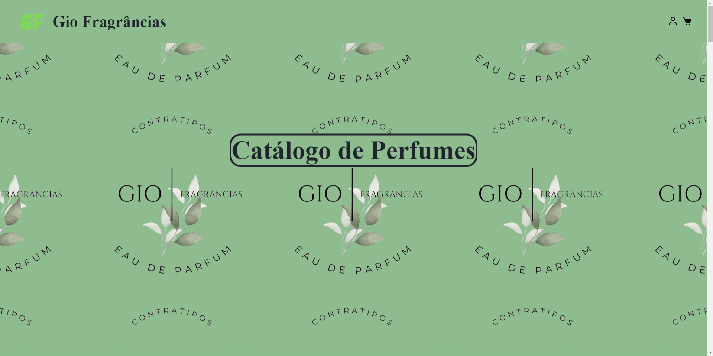
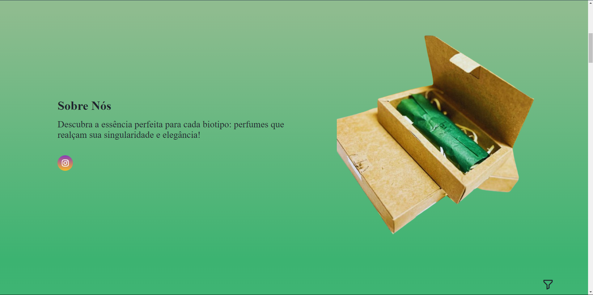
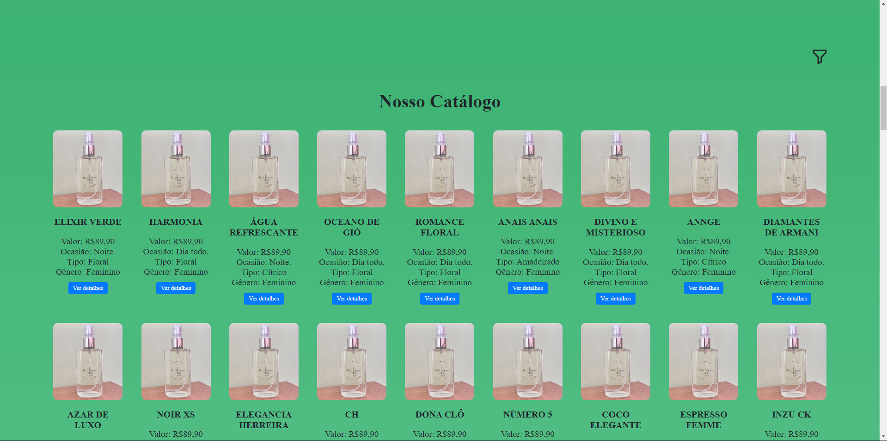
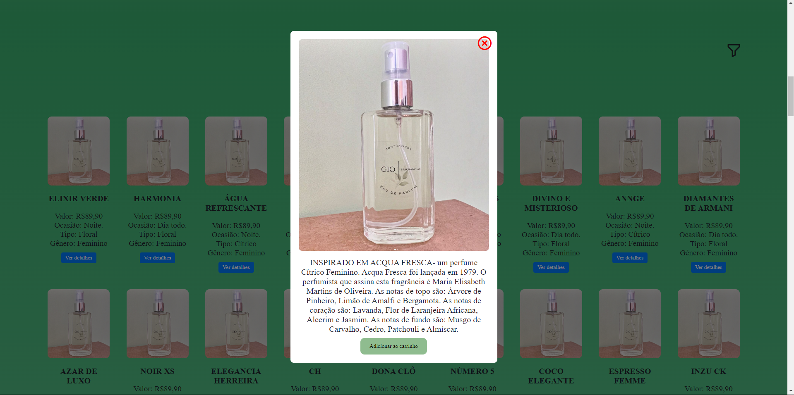
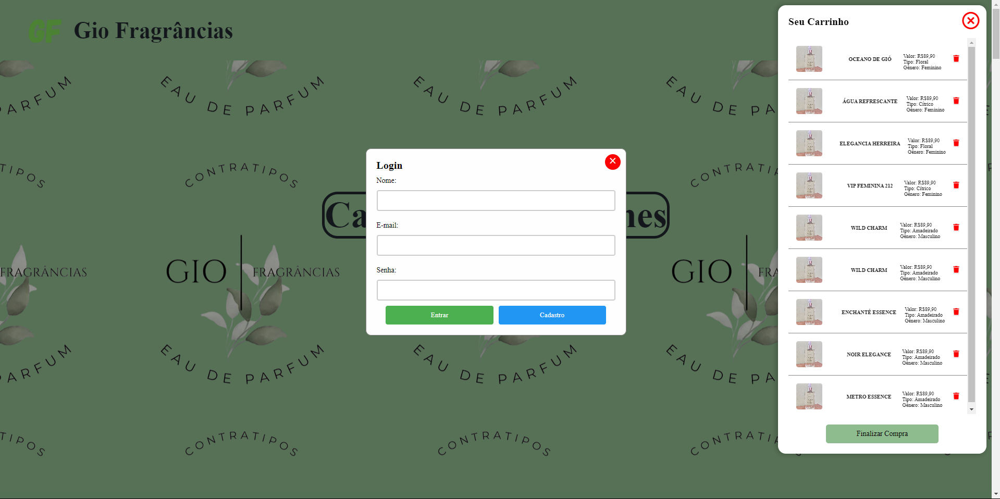

# 👩‍💼🏢 Projeto de Desenvolvimento Web com JS/PHP e Banco de Dados  
**Tema**: Catálogo de Perfumes - Gio Fragrância  
**Integrante**: Dávio Carvalho - 202208919251

## 📄 Sobre o Projeto
Este é um projeto de catálogo de perfumes desenvolvido para a marca **Gio Fragrância**. Ele foi construído utilizando HTML, CSS e JavaScript, oferecendo uma interface responsiva e dinâmica para visualização de diferentes perfumes, suas características e informações detalhadas. O projeto também conta com uma funcionalidade de login/cadastro de clientes, onde é possível armazenar informações como nome, número de telefone e endereço de entrega.

## 🎯 Objetivos
- 🛍️ Desenvolver uma aplicação web que permita aos usuários navegarem por uma lista de perfumes.
- 📜 Fornecer informações detalhadas sobre cada perfume, como nome, valor, tipo de fragrância e ocasião de uso.
- 👥 Implementar uma funcionalidade de login e cadastro para clientes.
- 📱 Criar uma interface moderna, amigável e responsiva que se adapta a diferentes dispositivos.

## 🔑 Funcionalidades Principais
- **🏠 Página Inicial (Home)**: Tela de boas-vindas com navegação simples para acessar o catálogo de perfumes.
- **🧴 Lista de Perfumes**: Exibe uma lista de perfumes com informações básicas (nome, valor, tipo de fragrância, ocasião).
- **🔍 Detalhes do Perfume**: Cada item possui um botão "Ver detalhes" que exibe mais informações em uma modal.
- **🔐 Login/Cadastro de Clientes**: Sistema de autenticação que permite ao usuário criar uma conta e acessar suas informações, incluindo dados de endereço para entrega.
- **📲 Design Responsivo**: O layout se adapta automaticamente a diferentes dispositivos e tamanhos de tela.
- **💾 Banco de Dados**: Integração de dados de cadastro e endereço de clientes usando FireBase.

## 🛠️ Estrutura do Projeto
- **index.html**: Página principal do catálogo.
- **styles.css**: Arquivo CSS para estilização e layout da aplicação.
- **script.js**: Arquivo JavaScript que implementa funcionalidades dinâmicas e interatividade.
- **/imgs**: Diretório contendo imagens dos perfumes e outros elementos visuais.

## 🧰 Tecnologias Utilizadas
- **🌐 HTML5**: Estruturação do conteúdo do site.
- **🎨 CSS3**: Estilização e design responsivo.
- **⚙️ JavaScript**: Adição de interatividade e funcionalidades dinâmicas.
- **🚀 GitHub Pages**: Hospedagem do projeto para acesso público.

## 👥 Público-alvo
O projeto foi desenvolvido para **clientes da Gio Fragrância**, proporcionando uma plataforma onde eles podem explorar as opções de perfumes disponíveis, com informações completas para auxiliar na escolha do produto ideal.

## 🏷️ Segmento
O site se enquadra no segmento de **cosméticos e fragrâncias**, focando em oferecer uma experiência digital otimizada para marcas de perfumes.

## 🖼️ Imagens do Projeto
  
  
  
  

## 🔗 Link de Acesso
Acesse o projeto em: [Catálogo de Perfumes Gio Fragrância](https://davio27.github.io/Projeto_Dev_Web/)

